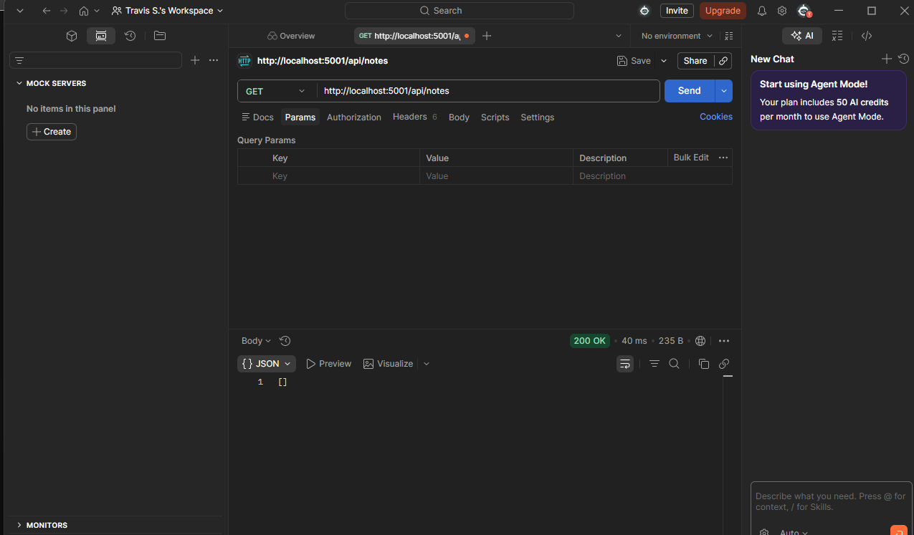
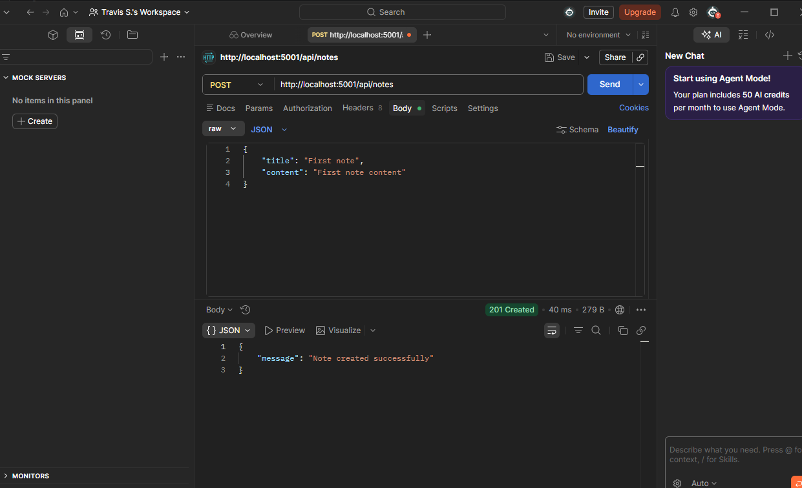
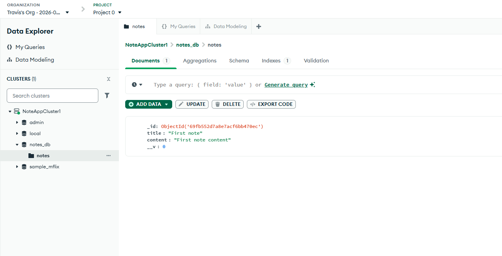

# MERN: Full-Stack Note-Taking App

## Installing Node.js

To begin, after installing node.js, I initiallsed it by first entering the backend folder with 'CD backend'. 
Then, I typed 'npm init -y' to initialise node and retrieve a package.json file.

I then installed Express with 'npm install express@4.18.2'

You'll need to set a "type" in package.json and set it to "module" to run express.js without error in the server using "node [file name]" in the terminal.

In your package.json file, it is also good to add a script. By adding a script, you are setting up a short-cut command to run in the terminal which executes (running the server).

For example, I set "dev": "node server.js", so whenever I run "npm run dev" in the terminal, it runs "node server.js". 

## PostMan

### What is it?

### Why use it?

### How to install PostMan

First, head over to https://www.postman.com/ and download for either Windows or Mac. 

### Testing Requests w/PostMan

First, you need to select a new request. This is a '+' icon featured somewhere on the left. The, choose HTTP.

**1. Get Request**

The first test I did was to send a Get request to the server, and the controller sent a response showing all available notes (none). So it was a success. 
To do it, I pasted the url into Postman, selecting 'Get' as the request:

**2. Post Request**

Second, I did a basic POST request  - this is where the user will create something. In this instance, it will be a new note title and note content. 

To test this on Postman, you need to create the data in postman - which will be JSON format, since I am using MongoDB. The data will simply be as shown in the image:

I sent the post request to the same url, since the notes page is where users will also create their notes. 

In my MongoDB account, the evidence for the POST request also shows:

